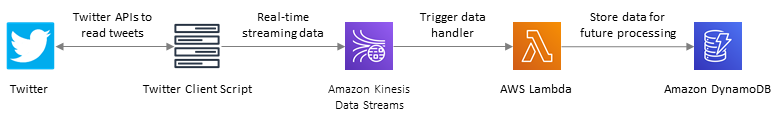

# Real-time Data-Stream Processing using AWS Kinesis
This solution is a reference implementation for AWS Kinesis service and its streaming data capabilities. The primary objective is to understand how to ingest large amount of real-time data into a serverless AWS cloud application and store it in a database. The solution can be extended by using AWS services like Elasticsearch, Comprehend, SageMaker etc. to process the real-time data. It is based on a sample [solution](https://github.com/aws-samples/lambda-refarch-streamprocessing) proposed by AWS.

 

## Solution Components
1. A python script that will use *Twitter API* to retrieve tweets in real-time and send them to Kinesis.
2. The CloudFormation template contains the following:
   - A Kinesis data stream to ingest tweets in real-time.
   - A Lambda function that reads data from Kinesis and stores them in a DynamoDB table.
   - A DynamoDB table to store data that can be later used for analytics etc.
   
## Twitter Client (data-stream producer)
The solution includes a python script which generates a stream of tweets in real-time. The tweets are filtered by a user specified **keyword** and are then sent to an AWS Kinesis Data Stream.

#### Usage:
`python twitter-client.py <filter keyword>`

For example:

`python twitter-client.py pizza`

## Input Parameters
The Cloudformation template requires the following input:
1. *LambdaS3BucketName*: S3 bucket name where Lambda code resides
2. *LambdaZipfileName*: Lambda code zipfile name (default: *index.zip*)
3. *LambdaHandler*: Lambda code handler name (default: *index.handler*)

The python script which generates data-stream requires the following environment variables to be set:
1. TWITTER_API_CONSUMER_KEY
2. TWITTER_API_CONSUMER_SECRET
3. TWITTER_API_TOKEN_KEY
4. TWITTER_API_TOKEN_SECRET
5. AWS_ACCESS_KEY_ID
6. AWS_SECRET_KEY
7. AWS_REGION
8. AWS_STREAM_NAME

## Instructions
1. To invoke Twitter APIs and read the tweets, you must have a [Twitter Developer account](https://developer.twitter.com/en/apply-for-access).
2. Deploy the CloudFormation template in AWS
3. Set the environment variables required for the python script
4. Execute the python script by providing a filter *keyword*
5. The real-time tweets will be sent to Kinesis and then stored in a DynamoDB table named `<stack-name>-EventData`

## Cleanup
1. Stop the python script
2. Delete the CloudFormation stack
